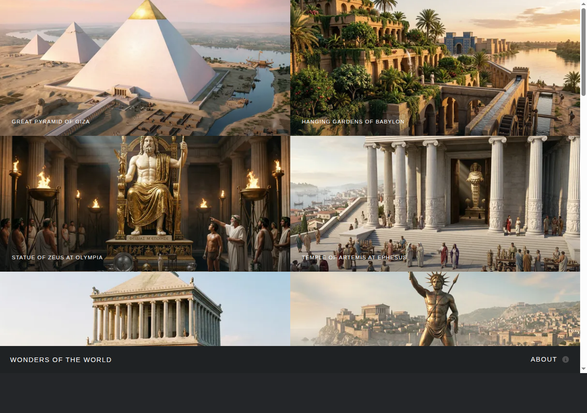

# Wonders of the World

This is a microsite featuring 21 Wonders of the World — spanning the Seven Wonders of the Ancient World, the New Seven Wonders, and other celebrated monuments of human civilisation.

It is based on the **Multiverse** template from HTML5 UP, converted into an [Astro](https://astro.build) project. It retains the slick, one-page gallery design and custom panel system while leveraging Astro's component-based architecture and optimized build pipeline.

## Screenshot



## Features

- **Lightweight Logic**: jQuery has been removed and replaced with [Alpine.js](https://alpinejs.dev) for state management and interactivity.
- **Component-Based**: Modularized into `Header`, `Footer`, `Gallery`, and `GalleryItem` Astro components.
- **Content Collections**: Gallery items are driven by an Astro [Content Collection](https://docs.astro.build/en/guides/content-collections/) (`src/content/pages/`). Each page is a Markdown file with frontmatter for `title`, `description`, `image`, and an optional `dataPosition`. The collection is defined in `src/content.config.ts` using a glob loader and Astro's `image()` schema helper for validated, optimized image references. Content covers 21 wonders across 21 pages (`01.md` – `21.md`), each with a title derived from the image filename, a concise description, and substantive body text.
- **Individual Pages**: Each gallery item has a corresponding page at `/pages/[id]` (e.g. `/pages/01`) generated from the content collection via `src/pages/pages/[id].astro`.
- **Astro Image Optimization**: Images are processed using Astro's built-in optimization (via `sharp`). This includes automatic format conversion (WebP), resizing, and optimized delivery for both thumbnails and high-resolution views.
- **Optimized Sass**: Modern SCSS structure using component-scoped styles within `.astro` files. Legacy manual prefixing has been removed in favor of standard CSS and modern build tools.
- **Modern Iconography**: Replaced self-hosted, monolithic Font Awesome with [astro-icon](https://github.com/natemoo-re/astro-icon). It uses the latest Font Awesome 6 icon sets, delivering only the necessary SVGs for a smaller, faster build.
- **Unified Design System**: A centralized `libs` module provides shared variables, functions, and mixins across all components via a clean `@use '../styles/libs' as *;` interface.
- **Lightbox**: Fully functional [PhotoSwipe](https://photoswipe.com/) lightbox integrated into the `Gallery` component. Features include:
  - Image caption overlay showing title and description
  - Clickable caption to open detailed info panel
  - Info button (ⓘ) in the toolbar to open a slide-up panel
  - Panel displays the full page title, description, and Markdown content
  - Info panel style matches the Footer's panel design for visual consistency
  - Panel closes automatically when the lightbox closes
- **Responsive**: Mobile-first design with synchronized breakpoints between CSS and JS.
- **SEO**: Comprehensive SEO meta tags are added to every page via the shared `Layout.astro` component:
  - `<meta name="description">` for search engines
  - `<link rel="canonical">` to prevent duplicate-content issues
  - Full **Open Graph** tags (`og:type`, `og:url`, `og:title`, `og:description`, `og:image`, `og:image:width`, `og:image:height`, `og:site_name`) for rich link previews on social platforms
  - **Twitter Card** tags (`twitter:card`, `twitter:title`, `twitter:description`, `twitter:image`) for Twitter/X rich previews
  - Per-page `og:image` on individual wonder pages uses Astro's image pipeline to serve an optimised 1200×630 JPEG derived from the wonder's own high-resolution image
  - A default `og:image` (`public/og-image.jpg`, 1200×630 JPEG converted from `screenshot.png`) is used on the gallery index page
- **Linting**: ESLint (with `eslint-plugin-astro`, `@typescript-eslint`, and `eslint-plugin-jsx-a11y`) and stylelint (with `stylelint-config-standard-scss` and `stylelint-config-html`) are configured with rules appropriate for an Astro + SCSS project.

## Design Inspiration

**Original Design by [html5up.net](https://html5up.net) | @ajlkn**
**Astro Migration by Gemini CLI**

*Free for personal and commercial use under the CCA 3.0 license ([html5up.net/license](https://html5up.net/license))*

## Getting Started

### Prerequisites

- [Node.js](https://nodejs.org/) (latest LTS recommended)
- `pnpm` (preferred) or `npm`

### Installation

```bash
# Install dependencies
pnpm install
```

### Development

```bash
# Start the development server
pnpm dev
```

### Linting

```bash
# Run ESLint and stylelint
pnpm lint

# ESLint only
pnpm lint:js

# stylelint only
pnpm lint:css

# Auto-fix issues
pnpm lint:fix

# Astro type checking
pnpm check
```

### Build

```bash
# Build for production
pnpm build
```

### Configuration

The site is configured to deploy to a subpath on [christham.net](https://christham.net):

- **Base Path**: Set to `wonder` in `astro.config.mjs`
- **Site URL**: `https://christham.net`
- **Deployment URL**: `https://christham.net/wonder/`

Astro automatically prefixes all internal links, assets, and static resources with the base path. PhotoSwipe image loading respects this configuration, so images display correctly at the subpath.

## Wonders

| # | Wonder | Era |
|---|--------|-----|
| 01 | Great Pyramid of Giza | Ancient (c. 2560 BCE) |
| 02 | Hanging Gardens of Babylon | Ancient (c. 600 BCE) |
| 03 | Statue of Zeus at Olympia | Ancient (c. 435 BCE) |
| 04 | Temple of Artemis at Ephesus | Ancient (c. 550 BCE) |
| 05 | Mausoleum at Halicarnassus | Ancient (c. 353 BCE) |
| 06 | Colossus of Rhodes | Ancient (c. 280 BCE) |
| 07 | Lighthouse of Alexandria | Ancient (c. 280 BCE) |
| 08 | Great Wall of China | Medieval (7th century BCE – 1644 CE) |
| 09 | Petra | Ancient (c. 4th century BCE) |
| 10 | Colosseum | Ancient (70–80 CE) |
| 11 | Chichén Itzá | Pre-Columbian (c. 600–1200 CE) |
| 12 | Machu Picchu | Pre-Columbian (c. 1450 CE) |
| 13 | Taj Mahal | Mughal (1632–1653 CE) |
| 14 | Christ the Redeemer | Modern (1931 CE) |
| 15 | Roman Forum | Ancient (7th century BCE – 7th century CE) |
| 16 | Library of Alexandria | Ancient (3rd century BCE) |
| 17 | Angkor Vat | Medieval (c. 1113–1150 CE) |
| 18 | Bagan | Medieval (9th–13th century CE) |
| 19 | Borobudur | Medieval (c. 800 CE) |
| 20 | Forbidden City | Imperial (1406–1420 CE) |
| 21 | Nalanda | Ancient (5th–12th century CE) |

## Credits

### Original Template
- **Design & Original Code**: AJ at [HTML5 UP](https://html5up.net)
- **Icons**: [Font Awesome](https://fontawesome.io)
- **Scripts**: [jQuery](https://jquery.com), [Poptrox](https://github.com/ajlkn/jquery.poptrox), and [Responsive Tools](https://github.com/ajlkn/responsive-tools)

### Astro Migration
- **Conversion**: Gemini CLI
